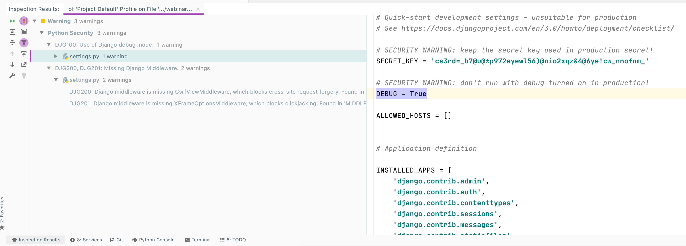

# Django security

This plugin allows for detection and warning of the security advice and best-practices for the Django framework. 

Including: 

* Scanning and warning of insecure versions of Django
* Scanning and warning of insecure versions for over 80 Django extensions
* Lexing and scanning of Django SQL templates to detect for bypassing of Django's SQL injection protection
* Scanning of QuerySets and filter methods for potential SQL injection flaws
* Scanning of `RawSql` APIs for potential SQL injection flaws
* Scanning and warning of your `settings.py` for poor security practices
* Detection and warning of Cross-Site-Scripting (XSS) bypassing
* Over 100 other best-practice and general Python security checks

## Django Extensions

The safety database bundled with this plugin has an index of insecure versions of Django, and over 80 Django extensions.

Select `Tools -> Check Python Package Security` inside PyCharm to scan your dependencies.


## Django configuration

This plugin comes with 3 checks for Django settings files:

* [Debug mode enabled (DJG100)](checks/DJG100.md)
* [Django middleware is missing `CsrfViewMiddleware` (DJG200)](checks/DJG200.md)
* [Django middleware is missing `XFrameOptionsMiddleware` (DJG201)](checks/DJG201.md)

Run PyCharm's code inspection over your `settings.py` file, or look at the warnings within the file to see any issues:



## SQL injection in Django

Django comes with robust SQL injection protection, however there are documented ways that it can be bypassed using the standard APIs.

### Bypassing SQL injection with raw queries

The [DJG101](checks/DJG101.md) check looks for ways that Django SQL Injection protection is being bypassed, by using quoted parameters.

The check looks at the following use cases:

* Use of `RawSQL()` constructor directly
* Use of `cursor.execute()`
* Use of `raw()` on a `Manager` instance

Whilst the methods support parametrized queries, if the `%s` value is quoted with single-quotes, the value is still vulnerable to SQL injection.

This also applies to parametrized arguments,  where it includes a substitute reference, e.g. `'%(variable)s'`.

This check will raise a code warning for any occurrence of these issues:


#### Example

The first example is using the RawSQL constructor directly and annotating a query set:

```python
from django.db.models.expressions import RawSQL

qs.annotate(val=RawSQL("select col from sometable where othercol = '%s'", (someparam,)))  # this is bad!
```

Another example is using the `raw()` method on a manager to filter results, exposing SQL injection:

```python
from django import things
from .models import User

def my_view(self):
    User.objects.raw("SELECT * FROM myapp_person WHERE last_name = '%s'", [lname])  # this is also bad!
```

Cursors can also be exploited using the same technique:

```python
from django.db import connection

def my_custom_sql(self):
    with connection.cursor() as cursor:
        cursor.execute("UPDATE bar SET foo = 1 WHERE baz = %s", [self.baz])
        cursor.execute("SELECT foo FROM bar WHERE baz = '%s'", [self.baz])
        row = cursor.fetchone()
    return row
```
#### See Also

* [Official Documentation](https://docs.djangoproject.com/en/3.0/ref/models/expressions/#django.db.models.expressions.RawSQL)

### Bypassing SQL injection with a query-set `extra()` method

The [DJG103](checks/DJG103.md) check looks for ways that Django SQL Injection protection is being bypassed in the `extra()` query set function, by using quoted parameters.

This check will inspect **any** string literal within the keyword-arguments:

* "where", "select", "tables", "order_by", "params"

Because these arguments accept lists, iterables, dictionaries, nested dictionaries, the check does a deep inspection of string literals in the `extra()` call. 

#### Example

In this example, the value of the `othercol` is vulnerable to SQL injection:

```python
qs.extra(
    select={'val': "select col from sometable where othercol = '%s'"},
    select_params=(someparam,),
)
```

This would also apply to the where argument:

```python
MyDataModel.objects.extra(where=['headline="%s"'], params=['Lennon'])
```

#### See Also

* [Official Documentation](https://docs.djangoproject.com/en/3.0/ref/models/querysets/#extra)

### General SQL injection detection

Aside from the specific Django APIs, there is also a generic SQL injection check, [SQL100](checks/SQL100.md).

Looks for SQL injection by Python string formatting methods. Includes:

- Use of "f-string"
- Use for string.format()
- Use of `%` formatting

Will look for formatted string literals that start with:

- `INSERT INTO `
- `DELETE FROM`
- `ALTER TABLE `
- `DROP DATABASE `
- `CREATE DATABASE `

It will also look for strings that start with `SELECT ` and contain ` FROM `, as well as strings that start with ` UPDATE ` and contain ` SET `. 

Check is case-insensitive.

This check does not verify that the input is sanitized.

#### Examples

Each of the following expressions would trigger a warning for this check:

```python
id = get_id()  # Could be a SQLi response..

query1 = f"SELECT * FROM users WHERE id = {id}"

query2 = "SELECT * FROM users WHERE id = {0}" % id

query3 = "SELECT * FROM users WHERE id = {0}".format(id)

query4 = f"UPDATE users SET is_admin = 1 WHERE id = {id}"

query5 = f"DELETE FROM users WHERE id = {id}"

query6 = f"INSERT INTO users (id) VALUES ( id = {id} )"

query7 = f"SELECT * FROM users WHERE id = {id}"
```

## Cross-Site-Scripting (XSS) in Django

Django comes with a cross-site-scripting protection mechanism. It works via the templating systems (django's or jinja2).

Fields from the template's context dictionary will be HTML-escaped automatically.

[See `mark_safe()` documentation](https://docs.djangoproject.com/en/3.0/ref/utils/#module-django.utils.safestring)

### Detection and warning of safe strings

The [DJG102](checks/DJG102.md) check will detect and warn of occurrences of Django 1.1, 2 and 3 safe string types:

* `SafeString`
* `SafeBytes`
* `SafeText`
* `SafeUnicode`
* `mark_safe`

As the use of this function may be intentional, it is a weak warning by default.

#### Example

```python
from django.utils.safestring import mark_safe

mystr = '<b>Hello World</b>'
mystr = mark_safe(mystr)
```

